# Calzados Kiruz — GitOps eCommerce + Warehouse Kubernetes Infrastructure

## Architecture Summary

This repository implements a **GitOps-first Kubernetes infrastructure** for a multi-vendor ecommerce company with a robot-driven warehouse. All services are self-hosted on Kubernetes, managed by **ArgoCD** which continuously reconciles this Git repository as the single source of truth.

### Platform Overview

| Layer | Services |
|---|---|
| **Ecommerce** | Saleor (GraphQL API), Next.js Storefront, Odoo ERP/WMS |
| **Identity & Security** | Keycloak, Vaultwarden, WireGuard, OPNsense |
| **Infrastructure** | HAProxy, Keepalived, Cloudflare, Pi-hole, PowerDNS |
| **GitOps / CI-CD** | GitLab, ArgoCD, n8n, Ollama, Strapi |
| **Monitoring** | Prometheus, Grafana, Loki, Tempo, Alertmanager |
| **Storage** | PostgreSQL (Patroni), Redis, MinIO, Velero |
| **Warehouse / Robots** | AMR Controller, Mosquitto MQTT, InfluxDB |
| **Marketing** | Mailcow, Plausible, content-pipeline |

### Architecture Diagram

```mermaid
---
title: "Calzados Kiruz — E-commerce AI-Assisted Architecture"
---
flowchart LR
    %% ==================== STYLING ====================
    classDef internetStyle fill:#FFF9C4,stroke:#F9A825,stroke-width:2px,color:#F57F17,rx:12,ry:12
    classDef cloudflareStyle fill:#E8F5E9,stroke:#43A047,stroke-width:3px,color:#1B5E20,rx:16,ry:16
    classDef awsStyle fill:#E8F5E9,stroke:#66BB6A,stroke-width:2px,color:#2E7D32,rx:12,ry:12
    classDef dmzStyle fill:#FFCDD2,stroke:#E53935,stroke-width:3px,color:#B71C1C,rx:16,ry:16
    classDef lbStyle fill:#E3F2FD,stroke:#1E88E5,stroke-width:2px,color:#0D47A1,rx:12,ry:12
    classDef coreStyle fill:#E3F2FD,stroke:#42A5F5,stroke-width:2px,color:#1565C0,rx:12,ry:12
    classDef identityStyle fill:#FFF3E0,stroke:#FB8C00,stroke-width:2px,color:#E65100,rx:12,ry:12
    classDef storageStyle fill:#E0F7FA,stroke:#00ACC1,stroke-width:2px,color:#006064,rx:12,ry:12
    classDef monStyle fill:#F1F8E9,stroke:#7CB342,stroke-width:2px,color:#33691E,rx:12,ry:12
    classDef gitopsStyle fill:#EDE7F6,stroke:#7E57C2,stroke-width:2px,color:#4527A0,rx:12,ry:12
    classDef aiStyle fill:#F3E5F5,stroke:#AB47BC,stroke-width:2px,color:#6A1B9A,rx:12,ry:12
    classDef warehouseStyle fill:#FCE4EC,stroke:#EC407A,stroke-width:2px,color:#880E4F,rx:12,ry:12

    classDef mainNode font-size:16px,font-weight:bold
    classDef subNode font-size:14px
    classDef smallNode font-size:12px

    %% ==================== INTERNET ====================
    subgraph INET["🌐 Internet"]
        direction TB
        U_DESK["🖥️ PC / Tablet Users\ndesktop"]
        U_MOB["📱 Mobile Users\nsmartphone / PWA"]
        U_VEND["🏪 Vendors / Partners"]
    end

    %% ==================== CLOUDFLARE EDGE ====================
    subgraph CF["☁️ Cloudflare Edge"]
        direction TB
        CF_DNS["🌐 **Cloudflare**\nDNS + WAF + DDoS"]
        CF_CDN["⚡ **Global CDN Cache**\nstatic asset caching"]
        CF_TUNNEL["🔐 **Cloudflare Tunnel**\nZero Trust admin"]
        CF_AI_GW["🤖 **AI Gateway**\nrouting + caching + cost opt"]
    end

    %% ==================== AWS ====================
    subgraph AWS["🟢 AWS (pay-as-you-go)"]
        direction TB
        S3_CF["📦 **S3 + CloudFront**\nstatic assets & media"]
        AWS_BKP["💾 **Backup / Snapshots**"]
    end

    %% ==================== DMZ ====================
    subgraph DMZ["🔴 DMZ"]
        OPNSENSE["🛡️ **OPNsense NGFW**\nSuricata IDS/IPS"]
    end

    %% ==================== LOAD BALANCER ====================
    subgraph LB["⚖️ Load Balancer (On-Prem)"]
        direction TB
        KEEPALIVED["🎯 **Virtual IP**\nKeepalived"]
        HAPROXY["🔀 **HAProxy**\nSSL termination"]
        UA_NOTE["Mobile :3001 / Desktop :3000"]
    end

    %% ==================== KUBERNETES ====================
    subgraph K8S["☸️ On-Premise Kubernetes"]

        subgraph CE["🛒 core-ecommerce ns"]
            direction TB
            SALEOR["⚙️ **Saleor**\nGraphQL API"]
            NEXTJS_D["💻 **Next.js Desktop**\nport 3000"]
            NEXTJS_M["📱 **Next.js Mobile**\nport 3001 · PWA"]
            ODOO["🏭 **Odoo ERP / WMS**\ninventory + warehouse mgmt"]
        end

        subgraph IDS["🔐 identity ns"]
            KEYCLOAK["🔑 **Keycloak SSO**\nauth + identity"]
        end

        subgraph STOR["🗄️ storage ns"]
            direction LR
            PG["🐘 **PG**\nCloudNativePG HA"]
            REDIS_K["⚡ **Redis**\nSentinel HA"]
            MINIO_K["📦 **MinIO**\nS3 object store"]
        end

        subgraph MON["📊 monitoring ns"]
            PROMGRAF["📈 **Prometheus + Grafana**"]
        end

        subgraph GICD["🚀 gitops-cicd ns"]
            direction LR
            ARGO["🐙 **ArgoCD**"]
            GITL["🦊 **GitLab**"]
            N8N_K["🔄 **n8n**"]
        end

        subgraph AISVC["🤖 ai-services ns"]
            direction TB
            AI_CLIENT["🧠 **AI Client Service**\nroutes all LLM calls →\nCloudflare AI Gateway"]
            AI_TOOLS["📝 AI Descriptions · 🖼️ AI Images · 🔍 SEO Tools\ndynamic model: cheapest / fastest"]
        end

    end

    %% ==================== PHYSICAL WAREHOUSE ====================
    subgraph WH["🏭 Physical Warehouse"]
        direction LR
        AMR_HW["🤖 **AMR Robots + AS/RS**"]
        AMR_CTRL["🦾 **AMR Controller**\nWCS/WES"]
    end

    %% ==================== DATA FLOWS ====================
    U_DESK -->|HTTPS| CF_DNS
    U_MOB -->|HTTPS| CF_DNS
    U_VEND -->|HTTPS| CF_DNS
    CF_DNS --> CF_CDN

    CF_CDN -->|traffic| OPNSENSE
    OPNSENSE --> KEEPALIVED
    KEEPALIVED --> HAPROXY

    HAPROXY -->|":3000"| NEXTJS_D
    HAPROXY -->|":3001"| NEXTJS_M
    HAPROXY -->|":8000"| SALEOR
    HAPROXY -->|":8069"| ODOO

    NEXTJS_D --> SALEOR
    NEXTJS_M --> SALEOR
    SALEOR --> PG
    SALEOR --> REDIS_K
    SALEOR --> MINIO_K
    ODOO --> PG
    ODOO -->|"inv sync"| SALEOR
    KEYCLOAK --> PG

    CF_TUNNEL -.->|"Zero Trust"| ARGO
    CF_TUNNEL -.->|"Zero Trust"| PROMGRAF

    PROMGRAF -.->|"scrape metrics"| SALEOR
    PROMGRAF -.->|"backup sync"| AWS_BKP

    ARGO -->|"helm sync"| CE
    GITL -->|"CI/CD"| ARGO

    AI_CLIENT -->|"LLM calls"| CF_AI_GW
    CF_AI_GW -.->|"AI models"| AI_TOOLS
    SALEOR -->|"content gen"| AI_CLIENT
    N8N_K -->|"automation"| AI_CLIENT

    S3_CF -->|"static assets"| CF_CDN

    AMR_HW -->|"WiFi"| AMR_CTRL
    AMR_CTRL -->|"MQTT + stock"| ODOO

    %% ==================== APPLY CLASSES ====================
    class U_DESK,U_MOB,U_VEND internetStyle
    class CF_DNS,CF_CDN,CF_TUNNEL,CF_AI_GW cloudflareStyle
    class S3_CF,AWS_BKP awsStyle
    class OPNSENSE dmzStyle
    class KEEPALIVED,HAPROXY,UA_NOTE lbStyle
    class SALEOR,NEXTJS_D,NEXTJS_M,ODOO coreStyle
    class KEYCLOAK identityStyle
    class PG,REDIS_K,MINIO_K storageStyle
    class PROMGRAF monStyle
    class ARGO,GITL,N8N_K gitopsStyle
    class AI_CLIENT,AI_TOOLS aiStyle
    class AMR_HW,AMR_CTRL warehouseStyle

    class SALEOR,ODOO,CF_DNS,HAPROXY,ARGO,AI_CLIENT mainNode
    class NEXTJS_D,NEXTJS_M,PG,REDIS_K,MINIO_K,KEYCLOAK,PROMGRAF,GITL subNode
    class UA_NOTE,AWS_BKP,AI_TOOLS smallNode
```



See [docs/architecture.md](docs/architecture.md) for additional detailed diagrams:
- High-Level Architecture (User → Cloudflare → HAProxy → K8s)
- GitOps Flow (GitLab → ArgoCD → Helm Charts → Apps)
- Robot Warehouse Integration (Odoo WMS → AMR → Robots → Inventory)

---

## Repository Structure

```
e-commerceStack/
├── apps/                   # All Helm charts, one sub-dir per service
├── clusters/               # Per-cluster ArgoCD app manifests + config
├── policies/               # Kubernetes NetworkPolicies
├── monitoring/             # Prometheus rules, Grafana dashboards, Velero
├── scripts/                # Bootstrap and utility scripts
└── docs/                   # Architecture diagrams and runbooks
```

---

## Quick Bootstrap

```bash
# 1. Install ArgoCD into the cluster
kubectl create namespace argocd
helm repo add argo https://argoproj.github.io/argo-helm
helm install argocd argo/argo-cd -n argocd -f apps/gitops-cicd/argocd/values.yaml

# 2. Register this repository
kubectl apply -f clusters/production/argocd-apps.yaml -n argocd

# 3. Sync all applications
argocd app sync --selector env=production
```

See [docs/deployment-guide.md](docs/deployment-guide.md) for the full step-by-step guide.

---

## Namespace Plan

| Namespace | Purpose |
|---|---|
| `core-ecommerce` | Saleor, Next.js, Stripe Connect |
| `identity-security` | Keycloak, Vaultwarden, WireGuard |
| `infrastructure` | HAProxy, Keepalived, Pi-hole, PowerDNS |
| `gitops-cicd` | GitLab, ArgoCD, n8n, Ollama |
| `monitoring` | Prometheus, Grafana, Loki, Tempo |
| `storage` | PostgreSQL, Redis, MinIO |
| `warehouse-robots` | AMR Controller, Mosquitto, InfluxDB |
| `marketing` | Mailcow, Plausible, content-pipeline |
