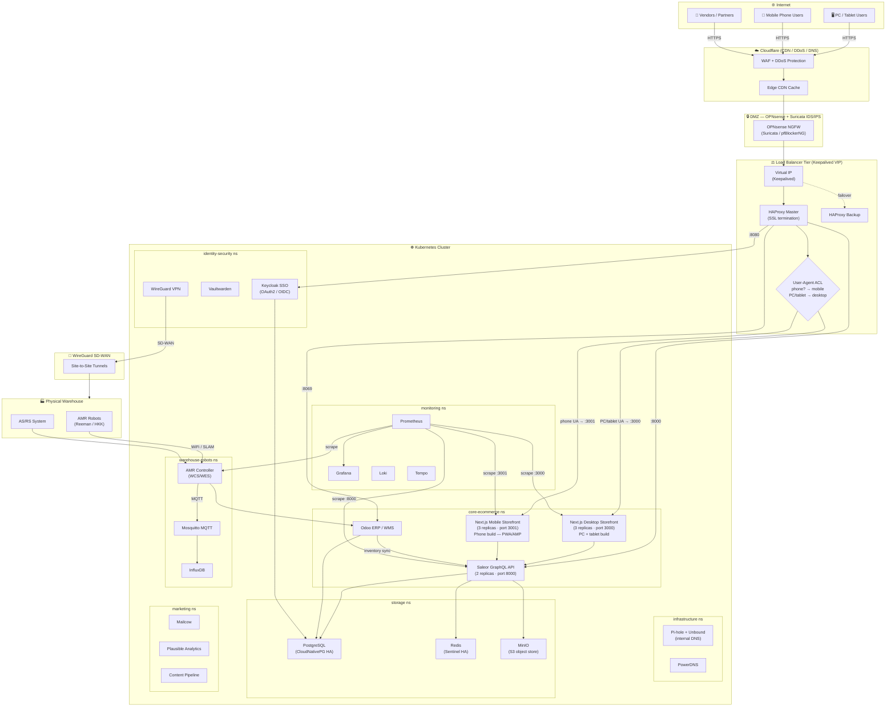
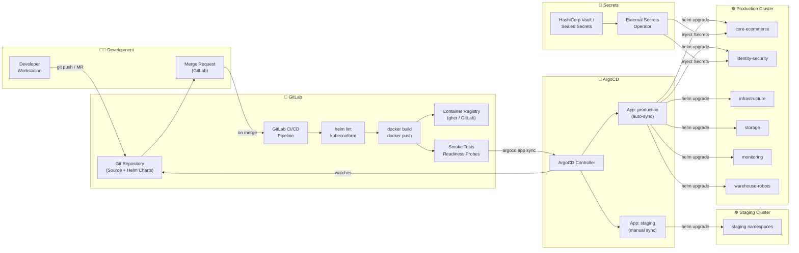
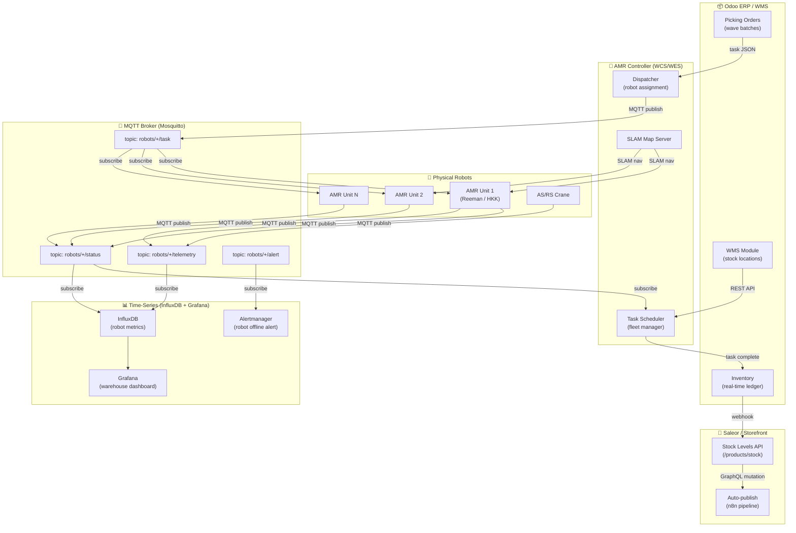

# Architecture Diagrams

## Diagram 1 — High-Level Architecture

```mermaid
graph TB
    subgraph Internet["🌐 Internet"]
        USER_DESKTOP["🖥️  PC / Tablet Users"]
        USER_MOBILE["📱 Mobile Phone Users"]
        VENDOR["🏪 Vendors / Partners"]
    end

    subgraph Cloudflare["☁️ Cloudflare (CDN / DDoS / DNS)"]
        CF_WAF["WAF + DDoS Protection"]
        CF_CDN["Edge CDN Cache"]
    end

    subgraph DMZ["🔒 DMZ — OPNsense + Suricata IDS/IPS"]
        OPNSENSE["OPNsense NGFW\n(Suricata / pfBlockerNG)"]
    end

    subgraph LB["⚖️ Load Balancer Tier (Keepalived VIP)"]
        VIP["Virtual IP\n(Keepalived)"]
        HAP_MASTER["HAProxy Master\n(SSL termination)"]
        HAP_BACKUP["HAProxy Backup"]
        UA_DECISION{"User-Agent ACL\nphone? → mobile\nPC/tablet → desktop"}
    end

    subgraph K8S["☸️  Kubernetes Cluster"]
        subgraph ce["core-ecommerce ns"]
            SALEOR["Saleor GraphQL API\n(2 replicas · port 8000)"]
            NEXTJS_D["Next.js Desktop Storefront\n(3 replicas · port 3000)\nPC + tablet build"]
            NEXTJS_M["Next.js Mobile Storefront\n(3 replicas · port 3001)\nPhone build — PWA/AMP"]
            ODOO["Odoo ERP / WMS"]
        end
        subgraph ids["identity-security ns"]
            KEYCLOAK["Keycloak SSO\n(OAuth2 / OIDC)"]
            VAULT_W["Vaultwarden"]
            WG["WireGuard VPN"]
        end
        subgraph infra["infrastructure ns"]
            PIHOLE["Pi-hole + Unbound\n(internal DNS)"]
            PDNS["PowerDNS"]
        end
        subgraph stor["storage ns"]
            PG["PostgreSQL\n(CloudNativePG HA)"]
            REDIS["Redis\n(Sentinel HA)"]
            MINIO["MinIO\n(S3 object store)"]
        end
        subgraph mon["monitoring ns"]
            PROM["Prometheus"]
            GRAF["Grafana"]
            LOKI["Loki"]
            TEMPO["Tempo"]
        end
        subgraph wr["warehouse-robots ns"]
            AMR["AMR Controller\n(WCS/WES)"]
            MQTT["Mosquitto MQTT"]
            INFLUX["InfluxDB"]
        end
        subgraph mkt["marketing ns"]
            MAILCOW["Mailcow"]
            PLAUS["Plausible Analytics"]
            CPIPE["Content Pipeline"]
        end
    end

    subgraph Warehouse["🏭 Physical Warehouse"]
        AMR_HW["AMR Robots\n(Reeman / HKK)"]
        ASRS["AS/RS System"]
    end

    subgraph WG_SDWAN["🔐 WireGuard SD-WAN"]
        SITE2SITE["Site-to-Site Tunnels"]
    end

    USER_DESKTOP -->|HTTPS| CF_WAF
    USER_MOBILE  -->|HTTPS| CF_WAF
    VENDOR       -->|HTTPS| CF_WAF
    CF_WAF --> CF_CDN
    CF_CDN --> OPNSENSE
    OPNSENSE --> VIP
    VIP --> HAP_MASTER
    VIP -.->|failover| HAP_BACKUP
    HAP_MASTER --> UA_DECISION
    UA_DECISION -->|"phone UA → :3001"| NEXTJS_M
    UA_DECISION -->|"PC/tablet UA → :3000"| NEXTJS_D
    HAP_MASTER -->|":8000"| SALEOR
    HAP_MASTER -->|":8069"| ODOO
    HAP_MASTER -->|":8080"| KEYCLOAK
    NEXTJS_D --> SALEOR
    NEXTJS_M --> SALEOR
    SALEOR --> PG
    SALEOR --> REDIS
    SALEOR --> MINIO
    ODOO --> PG
    KEYCLOAK --> PG
    AMR -->|MQTT| MQTT
    MQTT --> INFLUX
    AMR_HW -->|WiFi / SLAM| AMR
    ASRS --> AMR
    AMR --> ODOO
    ODOO -->|inventory sync| SALEOR
    PROM -->|scrape :8000| SALEOR
    PROM -->|scrape :3000| NEXTJS_D
    PROM -->|scrape :3001| NEXTJS_M
    PROM -->|scrape| AMR
    PROM --> GRAF
    WG -->|SD-WAN| SITE2SITE
    SITE2SITE --> Warehouse
```

---

## Diagram 2 — GitOps Flow

```mermaid
flowchart LR
    subgraph Dev["👩‍💻 Development"]
        DEV["Developer\nWorkstation"]
        PR["Merge Request\n(GitLab)"]
    end

    subgraph GL["🦊 GitLab"]
        REPO["Git Repository\n(Source + Helm Charts)"]
        CI["GitLab CI/CD\nPipeline"]
        REG["Container Registry\n(ghcr / GitLab)"]
        LINT["helm lint\nkubeconform"]
        BUILD["docker build\ndocker push"]
        SMOKE["Smoke Tests\nReadiness Probes"]
    end

    subgraph ARGO["🐙 ArgoCD"]
        ARGOCTL["ArgoCD Controller"]
        APP_PROD["App: production\n(auto-sync)"]
        APP_STG["App: staging\n(manual sync)"]
    end

    subgraph K8S_STG["☸️  Staging Cluster"]
        STG_NS["staging namespaces"]
    end

    subgraph K8S_PROD["☸️  Production Cluster"]
        PROD_CE["core-ecommerce"]
        PROD_IDS["identity-security"]
        PROD_INF["infrastructure"]
        PROD_S["storage"]
        PROD_M["monitoring"]
        PROD_WR["warehouse-robots"]
    end

    subgraph ESO["🔑 Secrets"]
        VAULT["HashiCorp Vault /\nSealed Secrets"]
        ESO_OP["External Secrets\nOperator"]
    end

    DEV -->|git push / MR| REPO
    REPO --> PR
    PR -->|on merge| CI
    CI --> LINT
    LINT --> BUILD
    BUILD --> REG
    BUILD --> SMOKE
    SMOKE -->|argocd app sync| ARGOCTL
    ARGOCTL -->|watches| REPO
    ARGOCTL --> APP_STG
    ARGOCTL --> APP_PROD
    APP_STG -->|helm upgrade| STG_NS
    APP_PROD -->|helm upgrade| PROD_CE
    APP_PROD -->|helm upgrade| PROD_IDS
    APP_PROD -->|helm upgrade| PROD_INF
    APP_PROD -->|helm upgrade| PROD_S
    APP_PROD -->|helm upgrade| PROD_M
    APP_PROD -->|helm upgrade| PROD_WR
    VAULT --> ESO_OP
    ESO_OP -->|inject Secrets| PROD_CE
    ESO_OP -->|inject Secrets| PROD_IDS
```

---

## Diagram 3 — Robot Warehouse Integration

```mermaid
flowchart TB
    subgraph ERP["📦 Odoo ERP / WMS"]
        WMS["WMS Module\n(stock locations)"]
        PICKING["Picking Orders\n(wave batches)"]
        INV["Inventory\n(real-time ledger)"]
    end

    subgraph CTRL["🤖 AMR Controller (WCS/WES)"]
        SCHED["Task Scheduler\n(fleet manager)"]
        MAP["SLAM Map Server"]
        DISP["Dispatcher\n(robot assignment)"]
    end

    subgraph ROBOTS["🦾 Physical Robots"]
        AMR1["AMR Unit 1\n(Reeman / HKK)"]
        AMR2["AMR Unit 2"]
        AMRN["AMR Unit N"]
        ASRS_CR["AS/RS Crane"]
    end

    subgraph MQTT_BUS["📡 MQTT Broker (Mosquitto)"]
        T_STATUS["topic: robots/+/status"]
        T_TASK["topic: robots/+/task"]
        T_TELEM["topic: robots/+/telemetry"]
        T_ALERT["topic: robots/+/alert"]
    end

    subgraph TSDB["📊 Time-Series (InfluxDB + Grafana)"]
        IDB["InfluxDB\n(robot metrics)"]
        GDASH["Grafana\n(warehouse dashboard)"]
        ALERT_R["Alertmanager\n(robot offline alert)"]
    end

    subgraph CATALOG["🛒 Saleor / Storefront"]
        STOCK_SYNC["Stock Levels API\n(/products/stock)"]
        PUBLISH["Auto-publish\n(n8n pipeline)"]
    end

    WMS -->|REST API| SCHED
    PICKING -->|task JSON| DISP
    DISP -->|MQTT publish| T_TASK
    T_TASK -->|subscribe| AMR1
    T_TASK -->|subscribe| AMR2
    T_TASK -->|subscribe| AMRN
    AMR1 -->|MQTT publish| T_STATUS
    AMR2 -->|MQTT publish| T_STATUS
    AMRN -->|MQTT publish| T_STATUS
    AMR1 -->|MQTT publish| T_TELEM
    ASRS_CR -->|MQTT publish| T_TELEM
    T_STATUS -->|subscribe| SCHED
    T_STATUS -->|subscribe| IDB
    T_TELEM -->|subscribe| IDB
    T_ALERT -->|subscribe| ALERT_R
    IDB --> GDASH
    SCHED -->|task complete| INV
    INV -->|webhook| STOCK_SYNC
    STOCK_SYNC -->|GraphQL mutation| PUBLISH
    MAP -->|SLAM nav| AMR1
    MAP -->|SLAM nav| AMR2
```
